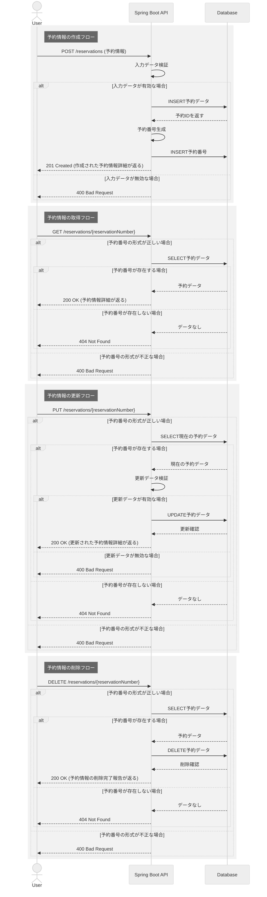

[ここを踏むとAPI仕様書が見れるのか？念のため再確認](https://ema-sakai.github.io/test_4/)  

## シーケンス図（Sequence Diagram）

```mermaid
%%{init: {'theme': 'neutral'}}%%
sequenceDiagram
    actor User
    participant API as Spring Boot API
    participant DB as Database

    rect rgba(0, 0, 0, 0.05)
        Note right of User: 予約情報の作成フロー
        User ->> API: POST /reservations (予約情報)
        API ->> API: 入力データ検証
        alt 入力データが有効な場合
            API ->> DB: INSERT予約データ
            DB -->> API: 予約IDを返す
            API ->> API: 予約番号生成
            API ->> DB: INSERT予約番号
            API -->> User: 201 Created (作成された予約情報詳細が返る)
        else 入力データが無効な場合
            API -->> User: 400 Bad Request
        end
    end

    rect rgba(0, 0, 0, 0.05)
        Note right of User: 予約情報の取得フロー
        User ->> API: GET /reservations/{reservationNumber}
        alt 予約番号の形式が正しい場合
            API ->> DB: SELECT予約データ
            alt 予約番号が存在する場合
                DB -->> API: 予約データ
                API -->> User: 200 OK (予約情報詳細が返る)
            else 予約番号が存在しない場合
                DB -->> API: データなし
                API -->> User: 404 Not Found
            end
        else 予約番号の形式が不正な場合
            API -->> User: 400 Bad Request
        end
    end

    rect rgba(0, 0, 0, 0.05)
        Note right of User: 予約情報の更新フロー
        User ->> API: PUT /reservations/{reservationNumber}
        alt 予約番号の形式が正しい場合
            API ->> DB: SELECT現在の予約データ
            alt 予約番号が存在する場合
                DB -->> API: 現在の予約データ
                API ->> API: 更新データ検証
                alt 更新データが有効な場合
                    API ->> DB: UPDATE予約データ
                    DB -->> API: 更新確認
                    API -->> User: 200 OK (更新された予約情報詳細が返る)
                else 更新データが無効な場合
                    API -->> User: 400 Bad Request
                end
            else 予約番号が存在しない場合
                DB -->> API: データなし
                API -->> User: 404 Not Found
            end
        else 予約番号の形式が不正な場合
            API -->> User: 400 Bad Request
        end
    end

    rect rgba(0, 0, 0, 0.05)
        Note right of User: 予約情報の削除フロー
        User ->> API: DELETE /reservations/{reservationNumber}
        alt 予約番号の形式が正しい場合
            API ->> DB: SELECT予約データ
            alt 予約番号が存在する場合
                DB -->> API: 予約データ
                API ->> DB: DELETE予約データ
                DB -->> API: 削除確認
                API -->> User: 200 OK (予約情報の削除完了報告が返る)
            else 予約番号が存在しない場合
                DB -->> API: データなし
                API -->> User: 404 Not Found
            end
        else 予約番号の形式が不正な場合
            API -->> User: 400 Bad Request
        end
    end
```

